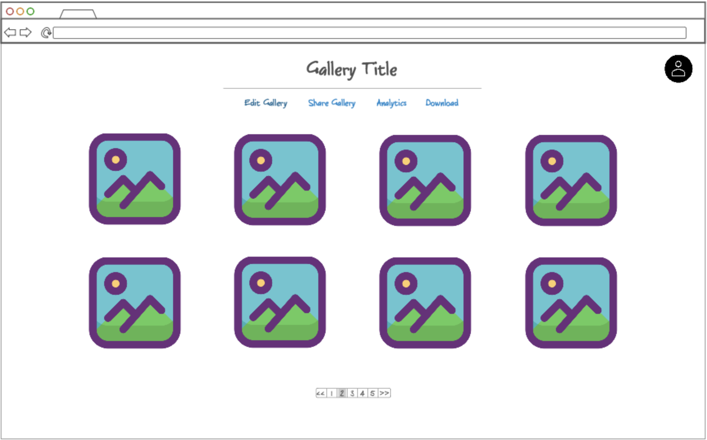

# Photo Galleries

## Specification Deliverable

### Elevator Pitch

Have you ever wanted an easy way to upload photos and share them with your friends or clients? Photo Galleries allows you to upload your pictures to a simple interface and automatically formats them into a pretty gallery. A link is also generated to allow others to view the gallery and download all the images into a zip file. You are able to create multiple galleries and modify them later after creating an account.

### Design

### Key Features

- Secure login over HTTPS
- Ability to upload jpeg or png filetypes
- Edit existing galleries after logging in
- Images stored securely on the server
- Generate unique, shareable links for each gallery
- Ability to view the gallery in realtime
- Analytics provide information on views and downloads

### Key Technologies

I will use the required technology in the following ways.

- **HTML** - Four HTML pages. One for users to login or register, one for users to upload photos, one for users to view their gallery, and one for visitors to view shared galleries.
- **CSS** - Clean and professional styling responsive on mobile and desktop. Hovering and clicking on photos will produce various effects.
- **React** - Provides login functionality, displays photos in a grid view, allows uploading multiple photos at once, and navigating through the galleries.
- **Web Services** - Backend services will handle:
    - Login
    - Uploading and storing photos
    - Managing galleries
    - Generating shareable links
    - Showing image location on a map
    - Retrieving general visitor location for analytics
- **Authentication** - Register and login users. Requires a user to be logged in to create a gallery.
- **Database** - Store users, galleries, photos, and links in the database.
- **WebSocket** - Provides real time updates for analytics, new galleries and upload status.

# [Notes](notes.md)
